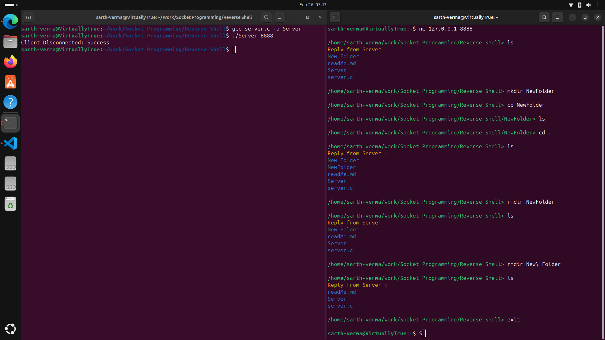
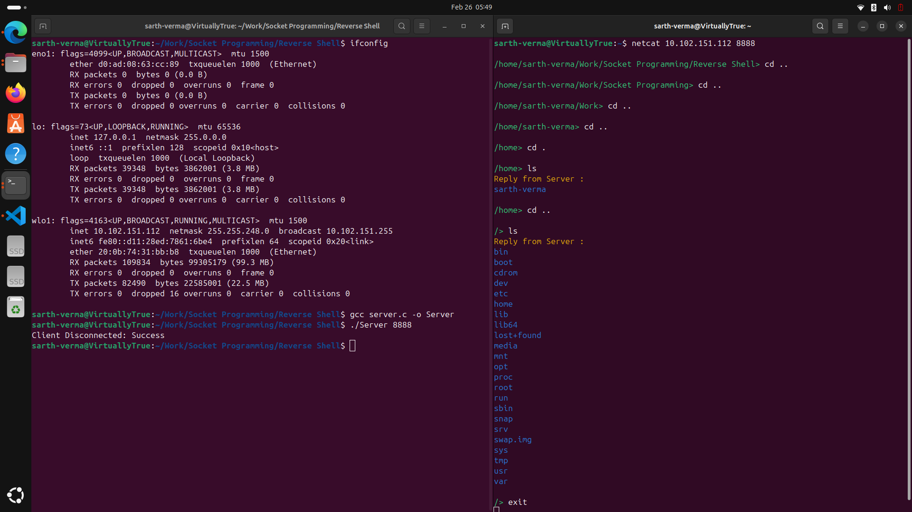

# Remote Shell

A simple and powerful Remote Shell implementation in C that allows users to execute commands on a remote machine through a terminal-like interface.

## Description

This Remote Shell (or Reverse Shell) is a program that establishes a connection between a server and client, enabling the client to execute commands on the server machine as if they were physically present. The implementation uses socket programming in C to create a secure and efficient communication channel.

## Features

- Real-time command execution
- Colored terminal output
- Displays current working directory in the prompt
- Supports all standard shell commands
- Clean error handling and disconnection management

## Prerequisites

- GCC compiler
- Linux/Unix operating system for the server
- Any operating system with netcat installed for the client

## Installation

1. Clone this repository:
   ```
   git clone https://github.com/yourusername/remote-shell.git
   cd remote-shell
   ```

2. Compile the server program:
   ```
   gcc -o server server.c
   ```

## Usage

### Server Side

Run the server on the machine where you want to execute commands:

```
./server <port_number>
```

Example:
```
./server 8888
```

### Client Side

Connect to the server using netcat:

```
netcat <server_ip> <port_number>
```

#### Local Connection Example



*Image: Using 127.0.0.1 (localhost) to connect and execute general commands*

#### Remote Connection Example



*Image: Using the server's actual IP address to connect and navigate to the root directory*

## Network Configuration

### For Local Network Access

By default, the server will accept connections on the specified port from any IP address. 

### For Remote Access

To allow connections from outside your local network, you may need to:

1. Configure port forwarding on your router
2. Temporarily disable the firewall on the Linux machine:
   ```
   sudo ufw disable
   ```
3. Re-enable the firewall when finished:
   ```
   sudo ufw enable
   ```

## Security Considerations

- This remote shell provides no authentication mechanism and should only be used in trusted networks
- Always re-enable your firewall after use
- Consider implementing encryption for sensitive data transfer
- Avoid running the server with root privileges

## How It Works

1. The server creates a socket and binds it to the specified port
2. When a client connects, the server creates a new shell process
3. Input from the client is sent to the shell process
4. Output from the shell is sent back to the client
5. The connection remains open until explicitly closed by the client

## Code Structure

- `socketCreationAndBind()`: Creates and configures the server socket
- `ShellProcess()`: Creates a shell process and sets up pipes for communication
- `AcceptingConnection()`: Handles client connections
- `ReadandWrite()`: Manages the I/O between client and shell
- `sendPrompt()`: Displays the current working directory as a prompt
- `isShellOutAvailable()`: Checks if there's output from the shell to be read
